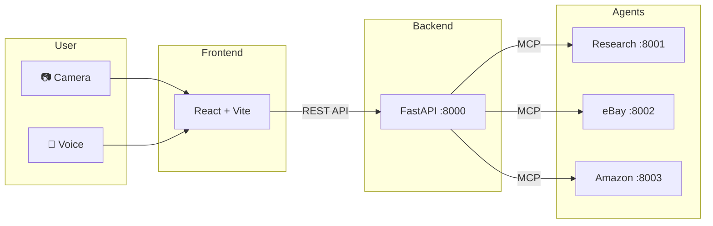

# AR Shopping Assistant 🛍️✨

> Point your camera at any product, say **"I want this"**, and get instant results from eBay and Amazon — all through a sleek AR interface with glassmorphism UI.

https://github.com/user-attachments/assets/demo.mp4

## ✨ Features

| Feature | Description |
|---------|-------------|
| 🎥 **Live AR Camera** | Full-screen webcam feed with real-time hand tracking |
| 🎙️ **Voice Control** | Wake with "Hey Cart", capture with "I want this", answer follow-ups naturally |
| 🤖 **AI Vision** | Multimodal AI identifies products from camera frames |
| 🔍 **Dual Search** | Simultaneous search across eBay and Amazon |
| 🧠 **RAG Memory** | Remembers your past searches for personalized results |
| 🪟 **Glassmorphism UI** | Apple Vision Pro-inspired frosted glass cards and badges |
| 🔐 **Authentication** | JWT + bcrypt secure user sessions |

## 🏗️ Architecture



The backend uses the **Model Context Protocol (MCP)** to coordinate three independent AI agent microservices. See [docs/ARCHITECTURE.md](docs/ARCHITECTURE.md) for the full system design with sequence diagrams.

## 🚀 Quick Start

### Prerequisites

- Python 3.13+
- Node.js 18+
- API keys (see [Configuration](#-configuration))

### Setup

```bash
# Clone
git clone https://github.com/Dogiparthy-Harsha/AR_Shopping_Assistant.git
cd AR_Shopping_Assistant

# Backend
cd backend
python3 -m venv venv
source venv/bin/activate
pip install -r requirements.txt
cd ..

# Frontend
cd frontend
npm install
cd ..
```

### Configuration

Create a `.env` file in the **project root**:

```env
# AI (OpenRouter)
MAIN_AGENT_API_KEY=your_openrouter_key
RESEARCH_AGENT_API_KEY=your_openrouter_key

# Search
SERPER_API_KEY=your_serper_key
EBAY_CLIENT_ID=your_ebay_client_id
EBAY_CLIENT_SECRET=your_ebay_client_secret
RAINFOREST_API_KEY=your_rainforest_key

# RAG
OPENAI_API_KEY=your_openai_key
PINECONE_API_KEY=your_pinecone_key
PINECONE_ENVIRONMENT=us-east-1
```

### Run

```bash
./start.sh
```

Opens at **http://localhost:5173**. This single command starts:
- 3 MCP agent servers (ports 8001–8003)
- FastAPI backend (port 8000)
- Vite dev server (port 5173)

Press `Ctrl+C` to gracefully stop everything.

## 🎮 Usage

1. Open the app — camera feed fills the screen with **"Say Hey Cart to Wake"**
2. Say **"Hey Cart"** to activate
3. Point at a product and say **"I want this"**
4. AI identifies the product and asks clarifying questions (shown as a floating glass message)
5. Answer with your voice — results appear as glass cards on eBay (left) and Amazon (right)

## 📁 Project Structure

```
├── backend/
│   ├── api_mcp.py              # FastAPI main server
│   ├── agents/
│   │   ├── search_agents.py    # eBay + Amazon search logic
│   │   └── research_agent.py   # Web search verification
│   ├── mcp_servers/
│   │   ├── research_server.py  # :8001
│   │   ├── ebay_server.py      # :8002
│   │   └── amazon_server.py    # :8003
│   ├── auth.py                 # JWT authentication
│   ├── database.py             # SQLite via SQLAlchemy
│   ├── models.py               # ORM models
│   ├── embeddings.py           # RAG / Pinecone
│   ├── mcp_client.py           # MCP protocol client
│   └── requirements.txt
│
├── frontend/
│   ├── src/
│   │   ├── App.jsx             # Camera + voice + glassmorphism UI
│   │   ├── api/visionClaw.js   # Backend HTTP client
│   │   ├── hooks/useVoiceCommands.js
│   │   ├── components/
│   │   │   ├── HandTracker.jsx
│   │   │   └── SneakerModel.jsx
│   │   └── index.css           # Glass design system
│   ├── package.json
│   └── vite.config.js
│
├── docs/
│   ├── ARCHITECTURE.md         # Full system design + Mermaid diagrams
│   ├── MCP_GUIDE.md            # MCP setup guide
│   └── BUGFIXES.md             # Bug fix log
│
├── .env                        # API keys (gitignored)
├── .gitignore
├── start.sh                    # One-command startup
└── README.md
```

## 🛠️ Tech Stack

| Layer | Technology |
|-------|-----------|
| Frontend | React 18, Vite, Web Speech API, MediaPipe |
| UI | Glassmorphism — `backdrop-filter: blur()`, glass cards/pills |
| Backend | Python, FastAPI, Uvicorn |
| AI | Google Gemini (via OpenRouter), OpenAI Embeddings |
| Protocol | Model Context Protocol (MCP) |
| Storage | SQLite, Pinecone (vector DB) |
| Auth | JWT + bcrypt |
| APIs | eBay Browse, Rainforest (Amazon), Serper (web search) |

## 📖 Documentation

- [**ARCHITECTURE.md**](docs/ARCHITECTURE.md) — System design, Mermaid diagrams, component breakdown
- [**MCP_GUIDE.md**](docs/MCP_GUIDE.md) — MCP server setup & troubleshooting
- [**BUGFIXES.md**](docs/BUGFIXES.md) — Bug fix history

## 📄 License

MIT
