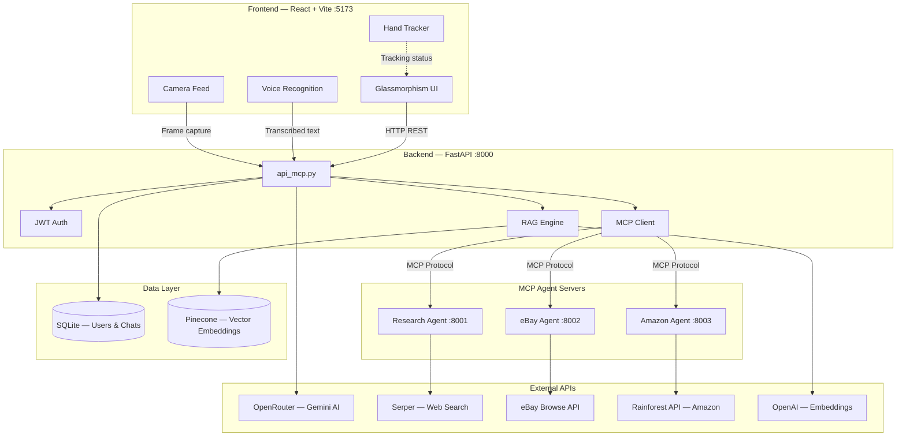
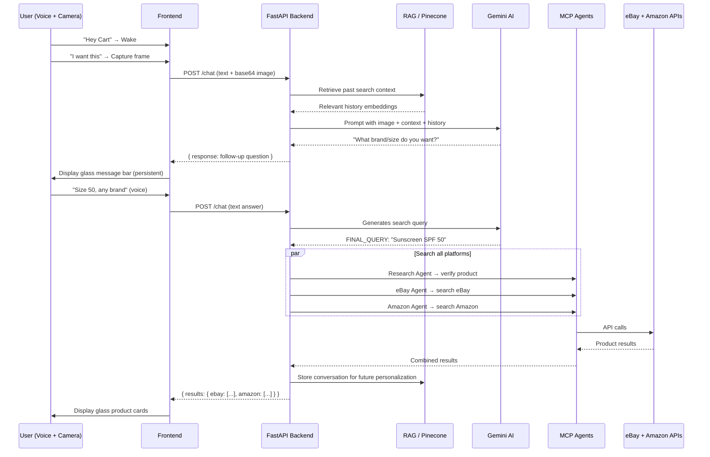
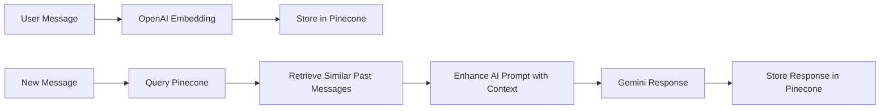

# Architecture — AR Shopping Assistant

## System Overview

An AR-powered shopping assistant that uses your live camera feed, voice commands, and AI vision to identify products and find them across eBay and Amazon in real-time.

## Request Flow

## Component Architecture

### Frontend (`frontend/`)

| File | Purpose |
|------|---------|
| `App.jsx` | Main app: camera, voice command handler, glassmorphism result panels |
| `api/visionClaw.js` | HTTP client for backend — frame capture + message sending |
| `hooks/useVoiceCommands.js` | Speech recognition: wake word ("Hey Cart"), capture ("I want this"), general speech |
| `components/HandTracker.jsx` | MediaPipe hand tracking overlay |
| `components/SneakerModel.jsx` | 3D AR model renderer (Three.js) |
| `index.css` | Glassmorphism design system — glass cards, pills, animations |

### Backend (`backend/`)

| File | Purpose |
|------|---------|
| `api_mcp.py` | FastAPI server: `/chat`, `/register`, `/login` endpoints |
| `auth.py` | JWT token generation + bcrypt password hashing |
| `database.py` | SQLite setup via SQLAlchemy |
| `models.py` | User, Conversation, ChatMessage ORM models |
| `embeddings.py` | Pinecone vector storage + OpenAI embedding generation |
| `mcp_client.py` | MCP protocol client — connects to agent servers |
| `agents/search_agents.py` | eBay (Browse API) + Amazon (Rainforest API) search logic |
| `agents/research_agent.py` | Product verification via Serper web search |
| `mcp_servers/research_server.py` | MCP server wrapper for research agent (port 8001) |
| `mcp_servers/ebay_server.py` | MCP server wrapper for eBay search (port 8002) |
| `mcp_servers/amazon_server.py` | MCP server wrapper for Amazon search (port 8003) |

## Tech Stack

| Layer | Technology |
|-------|-----------|
| Frontend | React 18, Vite, MediaPipe, Web Speech API |
| UI System | Glassmorphism (backdrop-filter blur, glass cards/pills) |
| Backend | Python, FastAPI, Uvicorn |
| AI | Google Gemini via OpenRouter, OpenAI Embeddings |
| Protocol | Model Context Protocol (MCP) over stdio |
| Databases | SQLite (users/chats), Pinecone (vector embeddings) |
| Auth | JWT + bcrypt |
| Shopping APIs | eBay Browse API, Rainforest API (Amazon), Serper (web search) |

## RAG Pipeline

Each user's data is isolated via `user_id` metadata filtering in Pinecone. The RAG system retrieves context from **past** conversations only (not the current one) to avoid circular references.

## Ports

| Service | Port |
|---------|------|
| Frontend (Vite dev) | 5173 |
| Backend API | 8000 |
| Research Agent | 8001 |
| eBay Agent | 8002 |
| Amazon Agent | 8003 |
